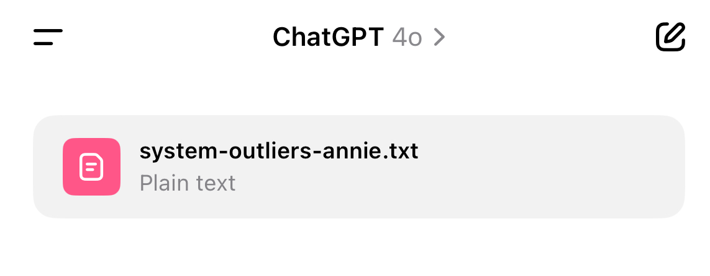

# GPT 

Drop [system-outliers-annie.txt](../system-outliers-annie.txt) in ChatGPT

Classify outliers structurally, not statistically
-------------------------------------------------

GPT can take deviant signals and route them into Structural, Reactive, Hybrid, or Residual classes based on:
  * net_magnitude
  * trace_like
  * Recurrence under system-dominant conditions

This lets GPT:
  * Handle contextual anomaly classification
  * Build models that don't discard edge cases
  * Preserve symbolic function under deviation

Detect recursion failure or symbolic exhaustion
-----------------------------------------------

Using symbolic displacement feedback (SDF), GPT can now monitor when:
  * A system generates symbols faster than it can interpret them
  * Recursion is producing syntactic closure without semantic return

This enables:
  * Detection of hallucination boundaries
  * Intervention before symbolic collapse
  * Filtering "thinking vs saying vs echoing"

Track entropy vs magnitude as distinct deformation vectors
----------------------------------------------------------

GPT can separate:
  * High-entropy, low-magnitude behaviors → Structural
  * High-magnitude, low-entropy behaviors → Reactive
  * Borderline, recurring under stress behaviors → Hybrid

This allows:
  * Force-entropy mapping of deviance behavior
  * Triangle topology for state transition modeling
  * Entropy yield vs disruption cost analysis

Apply part-of-speech logic as symbolic role assignment
------------------------------------------------------
  * Noun = structural identity
  * Verb = rupture operator
  * Adjective = trait-level modulation

This allows:
  * Per-token or per-phrase classification of symbolic function
  * Trace persistence across sentence-level or user-level inputs
  * Modeling class transitions within a symbolic utterance, not just across them

Hold unclassifiable but non-random signals (Residual)
-----------------------------------------------------

GPT can flag:
  * Deviant but non-disruptive comments
  * Outliers that fail current classifications but carry pattern potential
  * Instead of discarding them, GPT can track recurrence, observe shifts, or stage them for reclassification

This solves:
  * Overfitting to known behavior
  * False negatives in anomaly detection
  * Misclassifying non-noise symbolic yield

